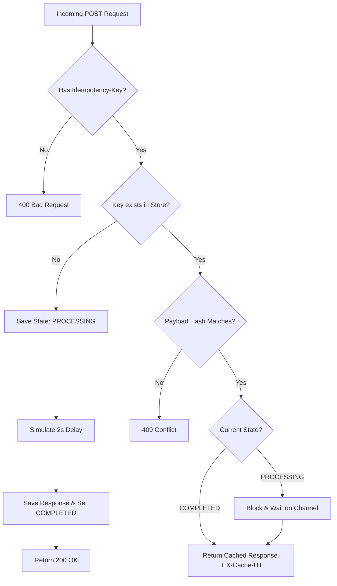

# FinSafe Idempotency Gateway

A high-performance, thread-safe idempotency middleware layer built with Go and Echo. This gateway ensures that duplicate payment requests caused by network retries never result in double charges.

## Architecture & Logic Flow

This flowchart illustrates the internal decision tree of the `/process-payment` endpoint.


## Setup Instructions
1. Ensure you have Go 1.20+ installed.

2. Clone the repository and navigate into the root directory.

3. Install dependencies:
`go mod tidy`

4. Run the server:
   `go run server.go`
The server will start on port :8080.

## API Documentation

`POST /api/v1/process-payment`
Simulates processing a payment. Requires an idempotency key.

Headers:

* `Content-Type: application/json`

* `Idempotency-Key: string (e.g., 9b1deb4d-3b7d-4bad-9bdd-2b0d7b3dcb6a)`

Request Body:
```json
{
  "amount": 100,
  "currency": "GHS"
}
```
Responses:

* `200 OK (First Request):` Successfully processed after a 2-second delay.

  `"Charged 100.00 GHS"`


* `200 OK (Duplicate Request):` Instant return. Includes `X-Cache-Hit: true` in headers.

  `"Charged 100.00 GHS"`


* `409 Conflict:` If the key is reused with a different payload.
  ```json
   {
    "error": "Idempotency key already used for a different request body."
   }
  ```
## Design Decisions

* In-Memory Concurrency: Utilized Go's native `sync.RWMutex` combined with a standard map for thread-safe reads and writes without the overhead of external dependencies like Redis.


* In-Flight Blocking: Handled concurrent requests (race conditions) using Go channels (`chan struct{}`). Secondary requests safely block and wait for the primary routine to close the channel before returning the cached result.

## The Developer's Choice Challenge
### Feature Implemented: Cryptographic Payload Hashing
Instead of storing raw JSON strings in the dictionary to validate against User Story 3 (Different Request, Same Key), the gateway computes an SHA-256 hash of the incoming request body bytes.
### Why it Matters in Fintech
Storing complete, raw JSON bodies in memory for every transaction creates massive memory bloat over time and slows down equality checks. By storing and comparing fixed-size cryptographic hashes, we reduce memory overhead by orders of magnitude and reduce payload validation to an $O(1)$ string comparison, keeping the gateway highly performant under heavy load.